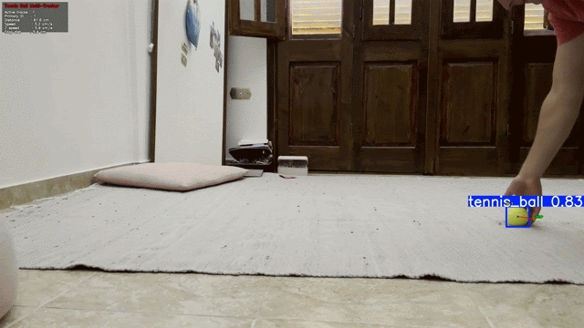

# Tennis Ball Detection, Distance, and Tracking Notebook


This project uses a YOLO model to detect tennis balls, estimate their distance from camera, estimate motion, and predict rolling trajectory.

Main notebook: [`notebooks/model_training.ipynb`](notebooks/model_training.ipynb)


## What The Notebook Does

The notebook is organized as a practical pipeline:

1. Setup imports and dataset paths.
2. Train a custom YOLO model (`yolo11n.pt` base) on `tennis_dataset`.
3. Validate the trained model.
4. Run quick inference on an image and webcam.
5. Estimate ball distance in centimeters from bounding-box size.
6. Calibrate focal length from a known-distance frame.
7. Track ball motion live and estimate speed.
8. Predict near-future rolling path using friction decay.
9. Run a multi-object tracking pass on recorded video and export annotated output.

Shared reusable helpers live in [`notebooks/tracking_utils.py`](notebooks/tracking_utils.py).

## Math Behind The Calculations

### 1) Distance From Bounding Box (Pinhole Camera Model)

The notebook approximates apparent ball diameter in pixels as:

$$
d_{px} = \frac{w_{px} + h_{px}}{2}
$$

Distance to camera is then estimated as:

$$
Z_{cm} = \frac{D_{real} \cdot F_{px}}{d_{px}}
$$

Where:
- $D_{real}$: real tennis-ball diameter (6.7 cm)
- $F_{px}$: camera focal length in pixels
- $d_{px}$: observed diameter in pixels

Implemented in `estimate_distance_cm(...)`.

### 2) Focal-Length Calibration

If ball distance is known during calibration ($Z_{known}$), focal length is estimated by rearranging the same formula:

$$
F_{px} = \frac{Z_{known} \cdot d_{px}}{D_{real}}
$$

Implemented in `estimate_focal_length_px(...)`.

### 3) Velocity Estimation

Using two consecutive tracked points with timestamps:

$$
v_x = \frac{x_t - x_{t-1}}{\Delta t}, \quad
v_y = \frac{y_t - y_{t-1}}{\Delta t}, \quad
v_z = \frac{z_t - z_{t-1}}{\Delta t}
$$

Image-plane speed:

$$
|v|_{px/s} = \sqrt{v_x^2 + v_y^2}
$$

Approximate metric speed:

$$
|v|_{cm/s} \approx \frac{|v|_{px/s} \cdot Z_{cm}}{F_{px}}
$$

### 4) Rolling Trajectory Prediction With Friction

Future path is predicted iteratively:

$$
\mathbf{p}_{k+1} = \mathbf{p}_k + \mathbf{v}_k \cdot \Delta t
$$
$$
\mathbf{v}_{k+1} = f \cdot \mathbf{v}_k
$$

Where $f < 1$ is a friction factor (in notebook: `FRICTION = 0.93`).

### 5) Multi-Track Association + Kalman Smoothing

For recorded video, detections are matched to tracks by nearest predicted position under a distance threshold. Each track uses a Kalman filter with state:

$$
[x, y, v_x, v_y]^T
$$

This smooths jitter and helps survive short missed detections.

## How To Start

### 1) Prerequisites

- Python 3.10+
- macOS with Apple Silicon (current notebook uses `device="mps"`), or adapt to `cpu`/`cuda`

### 2) Install Dependencies

From project root:

```bash
python3 -m venv .venv
source .venv/bin/activate
pip install -U pip
pip install ultralytics opencv-python numpy jupyter
```

### 3) Prepare Dataset

Expected layout (already used by the notebook):

```text
tennis_dataset/
  data.yaml
  classes.txt
  train/
    images/
    labels/
  valid/
    images/
    labels/
    videos/
```

### 4) Launch Notebook

```bash
cd notebooks
jupyter lab model_training.ipynb
```

(or `jupyter notebook model_training.ipynb`)

### 5) Run Cells In Guide Order

Inside the notebook, follow the markdown steps:

1. **Step 1: Setup and Train**
2. **Step 2: Quick Inference Check**
3. **Step 3: Live Distance Estimation**
4. **Step 4: Camera Calibration (Recommended)**
5. **Step 5: Tracking and Validation**

### 6) Where Outputs Go

Training and prediction artifacts are written under `notebooks/runs/`.

## Notes

- For better distance accuracy, calibrate focal length for your camera and replace `FOCAL_LENGTH_PX` in tracking cells.
- Distance/speed values are approximations and depend on stable detections, camera angle, and lens calibration quality.
- If you are publishing publicly, clear notebook outputs first to avoid sharing local absolute paths.
